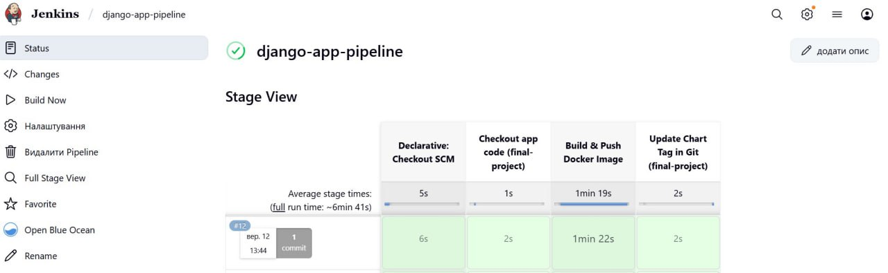
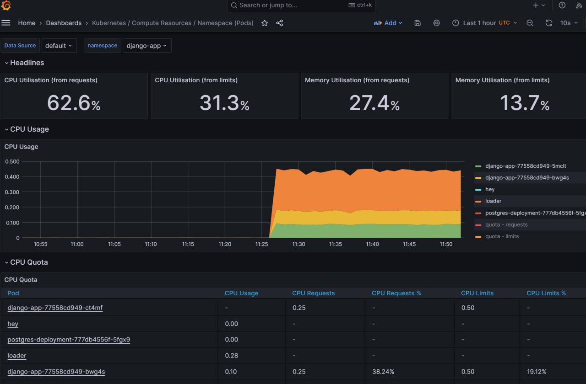

# DevOps CI/CD

**CI/CD Platform з Jenkins + Argo CD + Terraform + RDS + Prometheus + Grafana**







## Опис проєкту

Цей проєкт реалізує повний CI/CD процес для Django застосунку з моніторингом та управлінням метриками:

- **Terraform** для управління інфраструктурою
- **Jenkins** для Continuous Integration (збірка та публікація Docker образів)
- **Argo CD** для Continuous Deployment (GitOps підхід)
- **Kubernetes (EKS)** як платформа оркестрації
- **Helm** для управління конфігураціями Kubernetes
- **RDS/Aurora** для баз даних (універсальний модуль)
- **Prometheus** для збору та зберігання метрик
- **Grafana** для візуалізації метрик та моніторингу

## Архітектура системи

```
┌─────────────┐    ┌─────────────┐    ┌─────────────┐    ┌─────────────┐
│   Developer │────│     Git     │────│   Jenkins   │────│     ECR     │
│   (commit)  │    │ Repository  │    │ (CI/Build)  │    │ (Registry)  │
└─────────────┘    └─────────────┘    └─────────────┘    └─────────────┘
                           │                                      │
                           │                                      │
                           ▼                                      ▼
                   ┌─────────────┐                        ┌─────────────┐
                   │   Argo CD   │◄───────────────────────│ Kubernetes  │
                   │  (GitOps)   │                        │    (EKS)    │
                   └─────────────┘                        └─────────────┘
                           │                                      │
                           │                                      │
                           ▼                                      ▼
                   ┌─────────────┐                        ┌─────────────┐
                   │ RDS/Aurora  │◄───────────────────────│   Django    │
                   │ PostgreSQL  │                        │Application  │
                   └─────────────┘                        └─────────────┘
                                                                  │
                                                                  │
                                                                  ▼
                   ┌─────────────┐    ┌─────────────┐    ┌─────────────┐
                   │ Prometheus  │────│   Grafana   │────│ Kubernetes  │
                   │(Metrics)    │    │(Dashboard)  │    │ Monitoring  │
                   └─────────────┘    └─────────────┘    └─────────────┘
```

## Структура проєкту

```
📁 devops-ci-cd
├── .gitignore
├── README.md
├── assets
    ├── .gitkeep
    ├── screen_01.png
    ├── screen_02.jpeg
    └── screen_03.jpeg
├── backend.tf
├── charts
    └── django-app
    │   ├── Chart.yaml
    │   ├── templates
    │       ├── _helpers.tpl
    │       ├── configmap.yaml
    │       ├── deployment.yaml
    │       ├── hpa.yaml
    │       └── service.yaml
    │   └── values.yaml
├── kubernetes-secrets.yaml.template
├── main.tf
├── modules
    ├── argo_cd
    │   ├── argo_cd.tf
    │   ├── charts
    │   │   ├── Chart.yaml
    │   │   ├── templates
    │   │   │   ├── application.yaml
    │   │   │   └── repository.yaml
    │   │   └── values.yaml
    │   ├── outputs.tf
    │   ├── providers.tf
    │   ├── values.yaml
    │   └── variables.tf
    ├── ecr
    │   ├── ecr.tf
    │   ├── outputs.tf
    │   └── variables.tf
    ├── eks
    │   ├── aws_ebs_csi_driver.tf
    │   ├── eks.tf
    │   ├── outputs.tf
    │   └── variables.tf
    ├── jenkins
    │   ├── jenkins.tf
    │   ├── outputs.tf
    │   ├── providers.tf
    │   ├── values.yaml
    │   └── variables.tf
    ├── monitoring
    │   ├── monitoring.tf
    │   ├── outputs.tf
    │   ├── providers.tf
    │   ├── values
    │   │   ├── grafana-values.yaml
    │   │   └── prometheus-values.yaml
    │   └── variables.tf
    ├── rds
    │   ├── aurora.tf
    │   ├── outputs.tf
    │   ├── rds.tf
    │   ├── shared.tf
    │   └── variables.tf
    ├── s3-backend
    │   ├── dynamodb.tf
    │   ├── outputs.tf
    │   ├── s3.tf
    │   └── variables.tf
    └── vpc
    │   ├── outputs.tf
    │   ├── routes.tf
    │   ├── variables.tf
    │   └── vpc.tf
└── outputs.tf
```

## Модуль моніторингу (Prometheus + Grafana)

### Опис модуля

Модуль `monitoring` забезпечує повне розгортання системи моніторингу:

- **Prometheus** для збору та зберігання метрик
- **Grafana** для візуалізації та створення дашбордів
- **kube-state-metrics** для метрик Kubernetes кластера
- **LoadBalancer** доступ до обох сервісів
- **Persistent Storage** для збереження даних та конфігурацій

### Використання модуля

```terraform
module "monitoring" {
  source = "./modules/monitoring"

  cluster_name     = module.eks.cluster_name
  cluster_endpoint = module.eks.cluster_endpoint
  namespace        = "monitoring"

  # Storage configuration
  prometheus_storage_size = "20Gi"
  grafana_storage_size    = "5Gi"

  # Grafana configuration
  grafana_admin_password = "Admin12345!!"

  depends_on = [module.eks]
}
```

### Змінні модуля моніторингу

| Змінна                    | Тип    | За замовчуванням | Опис                                   |
| ------------------------- | ------ | ---------------- | -------------------------------------- |
| `cluster_name`            | string | -                | **Обов'язкова**: Назва EKS кластера    |
| `cluster_endpoint`        | string | -                | **Обов'язкова**: Endpoint EKS кластера |
| `namespace`               | string | "monitoring"     | Kubernetes namespace для моніторингу   |
| `prometheus_storage_size` | string | "20Gi"           | Розмір сховища для Prometheus          |
| `grafana_storage_size`    | string | "5Gi"            | Розмір сховища для Grafana             |
| `grafana_admin_password`  | string | "admin123"       | Пароль адміністратора Grafana          |

## Створювана інфраструктура

### AWS Ресурси

- **EKS Cluster** з версією Kubernetes 1.28
- **EC2 Node Group** з інстансами t3.medium (2-6 нод)
- **VPC** з публічними та приватними підмережами
- **ECR Repository** для Docker образів
- **RDS/Aurora PostgreSQL** для Django застосунку
- **S3 Bucket** для Terraform state
- **DynamoDB Table** для state locking
- **IAM Roles** та політики для всіх сервісів
- **EBS CSI Driver** для persistent volumes
- **LoadBalancer Services** для Prometheus та Grafana

### Kubernetes Ресурси

- **Jenkins** з Kaniko для збірки Docker образів
- **Argo CD** для GitOps деплойменту
- **Django Application** з автоматичним масштабуванням
- **Prometheus** для збору метрик
- **Grafana** з попередньо налаштованими дашбордами
- **kube-state-metrics** для метрик Kubernetes
- **LoadBalancer Services** для зовнішнього доступу
- **Persistent Volumes** для всіх stateful сервісів

## Передумови

### Встановлені інструменти:

1. **AWS CLI** з налаштованими credentials
2. **Terraform** (версія >= 1.0)
3. **kubectl** для роботи з Kubernetes
4. **Helm 3** для розгортання charts
5. **Git** для роботи з репозиторіями

### AWS Permissions:

- EKS повні права
- EC2 повні права
- IAM створення ролей
- S3 та DynamoDB права
- ECR повні права
- RDS повні права
- **ELB повні права** (для LoadBalancers)

## Покрокова інструкція виконання фінального проєкту

### Технічні вимоги

- **Інфраструктура:** AWS з використанням Terraform
- **Компоненти:** VPC, EKS, RDS, ECR, Jenkins, Argo CD, Prometheus, Grafana

### Етапи виконання

### **1. Підготовка середовища:**

#### Налаштування AWS CLI:

```bash
# Налаштуйте AWS CLI
aws configure

# Перевірте підключення
aws sts get-caller-identity
```

#### Ініціалізація Terraform:

```bash
# Клонуйте репозиторій
git clone https://github.com/ViktorSvertoka/devops-ci-cd.git
cd devops-ci-cd

# Переключіться на final-project гілку
git checkout final-project

# Ініціалізуйте Terraform
terraform init

# Перевірте всі необхідні змінні та параметри
terraform validate
terraform plan
```

### **2. Розгортання інфраструктури:**

#### Виконати команду розгортання:

```bash
# Розгорніть повну інфраструктуру (20-30 хвилин)
terraform apply

# Підтвердіть розгортання: yes
```

#### Налаштування kubectl:

```bash
# Налаштуйте доступ до EKS кластера
aws eks update-kubeconfig --region us-east-1 --name lesson-7-eks-cluster

# Перевірте підключення
kubectl get nodes
```

#### Перевірити стан ресурсів:

```bash
# Перевірити Jenkins
kubectl get all -n jenkins

# Перевірити Argo CD
kubectl get all -n argocd

# Перевірити Prometheus та Grafana
kubectl get all -n monitoring

# Перевірити всі LoadBalancer сервіси
kubectl get svc --all-namespaces | grep LoadBalancer
```

### **3. Перевірка доступності:**

#### **Наш підхід - LoadBalancer URLs:**

```bash
# Отримати всі URLs сервісів
echo "Your Complete CI/CD + Monitoring Stack:"
echo ""
echo "Prometheus: $(kubectl get svc prometheus-server -n monitoring -o jsonpath='{.status.loadBalancer.ingress[0].hostname}')"
echo "Grafana: $(kubectl get svc grafana -n monitoring -o jsonpath='{.status.loadBalancer.ingress[0].hostname}')"
echo "   Login: admin / $(kubectl get secret grafana -n monitoring -o jsonpath='{.data.admin-password}' | base64 --decode)"
echo ""
echo "Jenkins: $(kubectl get svc jenkins -n jenkins -o jsonpath='{.status.loadBalancer.ingress[0].hostname}'):8080"
echo "   Login: admin / admin123"
echo ""
echo "Argo CD: $(kubectl get svc argocd-server -n argocd -o jsonpath='{.status.loadBalancer.ingress[0].hostname}')"
echo "   Login: admin / $(kubectl get secret argocd-initial-admin-secret -n argocd -o jsonpath='{.data.password}' | base64 --decode)"
```

#### **Альтернативний підхід - Port-forwarding (якщо LoadBalancer недоступний):**

Jenkins:

```bash
kubectl port-forward svc/jenkins 8080:8080 -n jenkins
# Відкрийте: http://localhost:8080
```

Argo CD:

```bash
kubectl port-forward svc/argocd-server 8081:443 -n argocd
# Відкрийте: https://localhost:8081
```

### **4. Моніторинг та перевірка метрик:**

#### **Рекомендований підхід - Grafana LoadBalancer:**

1. **Відкрийте Grafana через LoadBalancer URL**
2. **Login:** `admin` / використайте пароль з команди вище
3. **Перевірте попередньо налаштовані дашборди:**
   - Kubernetes Overview Dashboard
   - Node Metrics Dashboard
   - Pod Metrics Dashboard

#### Prometheus перевірка:

1. **Відкрийте Prometheus через LoadBalancer URL**
2. **Перевірте метрики:**
   ```
   up                    # Статус всіх цілей моніторингу
   kube_node_info       # Інформація про ноди
   kube_pod_info        # Інформація про поди
   ```

#### **Альтернативний підхід - Port-forwarding:**

Grafana:

```bash
kubectl port-forward svc/grafana 3000:80 -n monitoring
# Відкрийте: http://localhost:3000
```

Prometheus:

```bash
kubectl port-forward svc/prometheus-server 9090:80 -n monitoring
# Відкрийте: http://localhost:9090
```

### **5. Перевірка стану метрик в Grafana Dashboard:**

1. **Увійдіть в Grafana**
2. **Перейдіть до Dashboards**
3. **Перевірте дашборди:**

   - Kubernetes Overview - загальна інформація про кластер
   - Node Metrics - метрики вузлів
   - Pod Metrics - метрики подів
   - Prometheus Stats - статистика самого Prometheus

4. **Перевірте, що дані надходять:**
   - Графіки показують актуальні дані
   - Метрики оновлюються в реальному часі
   - Немає помилок у збору даних

## Результати розгортання

### **Успішно розгорнуті компоненти:**

- **EKS Cluster**: Kubernetes кластер з 2 worker нодами
- **VPC**: Мережева інфраструктура з публічними та приватними підмережами
- **RDS PostgreSQL**: База даних для Django застосунків
- **ECR**: Container registry для Docker образів
- **Jenkins**: CI/CD платформа з LoadBalancer доступом
- **Argo CD**: GitOps deployment з web UI
- **Prometheus**: Збір та зберігання метрик з кластера
- **Grafana**: Візуалізація метрик з попередньо налаштованими дашбордами

### **Доступ до сервісів:**

**Всі сервіси доступні через LoadBalancer URLs (рекомендовано):**

- Зовнішній доступ з будь-якого місця
- Не потребує kubectl підключення
- Професійний production-ready підхід
- Можна ділитися URL з командою

**Port-forwarding (альтернатива):**

- Локальний доступ для діагностики
- Потребує активне kubectl підключення
- Корисно для troubleshooting

## Налаштування CI/CD Pipeline

### 1. Налаштування Jenkins

**Доступ до Jenkins UI:**

- Використайте LoadBalancer URL або port-forward
- Login: `admin` / `admin123`

**Налаштування Pipeline:**

1. New Item → Pipeline
2. Pipeline script from SCM
3. Git Repository: `https://github.com/ViktorSvertoka/devops-ci-cd.git`
4. Branch: `lesson-4`
5. Script Path: `Jenkinsfile`

### 2. Налаштування Argo CD

**Доступ до Argo CD UI:**

- Використайте LoadBalancer URL або port-forward
- Login: `admin` / отримайте пароль командою:
  ```bash
  kubectl get secret argocd-initial-admin-secret -n argocd -o jsonpath='{.data.password}' | base64 --decode
  ```

### 3. Налаштування моніторингу

**Grafana Dashboard:**

- Вже налаштовані дашборди для Kubernetes
- Prometheus як джерело даних
- Автоматичне оновлення метрик

## Моніторинг та логування

### Перевірка статусу всіх компонентів:

```bash
# Загальний статус кластера
kubectl get nodes
kubectl get pods --all-namespaces

# Статус моніторингу
kubectl get pods -n monitoring
kubectl get svc -n monitoring

# Статус CI/CD
kubectl get pods -n jenkins
kubectl get pods -n argocd

# LoadBalancer статус
kubectl get svc --all-namespaces | grep LoadBalancer
```

### Логи системи:

```bash
# Jenkins logs
kubectl logs -f deployment/jenkins -n jenkins

# Argo CD logs
kubectl logs -f deployment/argocd-server -n argocd

# Prometheus logs
kubectl logs -f deployment/prometheus-server -n monitoring

# Grafana logs
kubectl logs -f deployment/grafana -n monitoring
```
