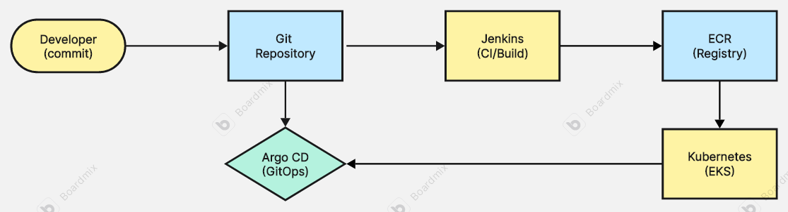

# DevOps CI/CD

# CI/CD Platform з Jenkins + Argo CD + Terraform

## Опис проєкту

Цей проєкт реалізує повний процес CI/CD для Django-застосунку з використанням сучасних DevOps-практик і стеку інструментів:

- **Terraform** для управління інфраструктурою (IaC)
- **Jenkins** для Continuous Integration (збірка та публікація Docker-образів)
- **Argo CD** для Continuous Deployment (GitOps-підхід)
- **Kubernetes** (EKS) як платформа оркестрації
- **Helm** для керування конфігураціями Kubernetes

## Архітектура системи



## Структура проєкту

```
devops-ci-cd/
│
├── main.tf                  # Головний файл для підключення модулів
├── backend.tf               # Налаштування бекенду для стейтів
├── outputs.tf               # Загальні виводи ресурсів
├── kubernetes-secrets.yaml  # Секрети для Jenkins (AWS credentials)
│
├── modules/                 # Каталог з усіма модулями
│   ├── s3-backend/          # Модуль для S3 та DynamoDB
│   │   ├── s3.tf
│   │   ├── dynamodb.tf
│   │   ├── variables.tf
│   │   └── outputs.tf
│   │
│   ├── vpc/                 # Модуль для VPC
│   │   ├── vpc.tf
│   │   ├── routes.tf
│   │   ├── variables.tf
│   │   └── outputs.tf
│   │
│   ├── ecr/                 # Модуль для ECR
│   │   ├── ecr.tf
│   │   ├── variables.tf
│   │   └── outputs.tf
│   │
│   ├── eks/                 # Модуль для Kubernetes кластера
│   │   ├── eks.tf
│   │   ├── aws_ebs_csi_driver.tf
│   │   ├── variables.tf
│   │   └── outputs.tf
│   │
│   ├── jenkins/             # Модуль для Jenkins
│   │   ├── jenkins.tf
│   │   ├── providers.tf
│   │   ├── variables.tf
│   │   ├── values.yaml
│   │   └── outputs.tf
│   │
│   └── argo_cd/             # Модуль для Argo CD
│       ├── argo_cd.tf
│       ├── providers.tf
│       ├── variables.tf
│       ├── values.yaml
│       ├── outputs.tf
│       └── charts/          # Helm chart для Argo CD Applications
│           ├── Chart.yaml
│           ├── values.yaml
│           └── templates/
│               ├── application.yaml
│               └── repository.yaml
│
├── charts/                  # Django Helm Chart
│   └── django-app/
│       ├── Chart.yaml
│       ├── values.yaml
│       └── templates/
│           ├── deployment.yaml
│           ├── service.yaml
│           ├── configmap.yaml
│           ├── hpa.yaml
│           └── _helpers.tpl
│
└── README.md               # Документація проєкту
```

## Створювана інфраструктура

**AWS Ресурси**

- **_EKS Cluster_** з версією Kubernetes 1.28
- **_EC2 Node Group_** з інстансами t3.medium (2–6 нод)
- **_VPC_** з публічними та приватними підмережами
- **_ECR Repository_** для зберігання Docker-образів
- **_S3 Bucket_** для Terraform state
- **_DynamoDB Table_** для state locking
- **_IAM Roles_** та політики доступу для всіх сервісів
- **_EBS CSI Driver_** для persistent volumes

**Kubernetes Ресурси**

- **_Jenkins з Kaniko_** для збірки Docker-образів
- **_Argo CD_** для GitOps-деплойменту
- **_Django Application_** з автоматичним масштабуванням (HPA)
- **_LoadBalancer Services_** для зовнішнього доступу
- **_Persistent Volumes_** для даних Jenkins

**Передумови**

- Встановлені інструменти:

1. AWS CLI з налаштованими credentials
2. Terraform (версія >= 1.0)
3. kubectl для роботи з Kubernetes
4. Helm 3 для розгортання charts
5. Git для роботи з репозиторіями

- AWS Permissions:

Повні права для EKS, EC2, IAM, S3, DynamoDB, ECR

## Покрокове розгортання

**Крок 1: Підготовка AWS Credentials**

```bash
# Налаштуйте AWS CLI
aws configure

# Отримайте ваш AWS Account ID
AWS_ACCOUNT_ID=$(aws sts get-caller-identity --query Account --output text)
echo "AWS Account ID: $AWS_ACCOUNT_ID"

```

**Крок 2: Підготовка секретів**

```bash
# Кодування AWS credentials в base64
echo -n "YOUR_AWS_ACCESS_KEY_ID" | base64
echo -n "YOUR_AWS_SECRET_ACCESS_KEY" | base64

# Створіть GitHub Personal Access Token і закодуйте
echo -n "YOUR_GITHUB_TOKEN" | base64

```

- Оновіть файл kubernetes-secrets.yaml вашими закодованими значеннями:

```bash
apiVersion: v1
kind: Secret
metadata:
  name: aws-credentials
  namespace: jenkins
type: Opaque
data:
  aws-access-key-id: <BASE64_ENCODED_ACCESS_KEY>
  aws-secret-access-key: <BASE64_ENCODED_SECRET_KEY>
---
apiVersion: v1
kind: Secret
metadata:
  name: github-token
  namespace: jenkins
type: Opaque
data:
  token: <BASE64_ENCODED_GITHUB_TOKEN>

```

**Крок 3: Розгортання інфраструктури**

```bash
# Ініціалізація Terraform
terraform init

# Перегляд планованих змін
terraform plan

# Розгортання інфраструктури (15–20 хвилин)
terraform apply

```

**Крок 4: Налаштування kubectl**

```bash
# Налаштування доступу до EKS кластера
aws eks update-kubeconfig --region us-east-1 --name lesson-7-eks-cluster

# Перевірка підключення
kubectl get nodes
kubectl get namespaces

```

**Крок 5: Застосування секретів**

```bash
# Застосування AWS credentials та GitHub token
kubectl apply -f kubernetes-secrets.yaml

# Перевірка створення секретів
kubectl get secrets -n jenkins

```

**Крок 6: Доступ до сервісів**

```bash
# Отримання URLs та паролів
terraform output deployment_instructions

# Отримання паролів окремо
terraform output jenkins_admin_password
terraform output argocd_admin_password

```

## Налаштування CI/CD Pipeline

### 1. Налаштування Jenkins

**Доступ до Jenkins UI:**

```bash
# Отримати URL Jenkins
terraform output jenkins_url

```

**Логін в Jenkins:**

- Username: admin
- Password: terraform output jenkins_admin_password

**Створення Pipeline Job:**

- New Item → Pipeline
- Pipeline script from SCM
- Git Repository: https://github.com/ViktorSvertoka/devops-ci-cd.git
- Branch: lesson-4
- Script Path: Jenkinsfile

**Налаштування Credentials:**

- Manage Jenkins → Credentials
- Додайте GitHub token з ID: github-token

### 2. Налаштування Argo CD

**Доступ до Argo CD UI:**

```bash
# Отримати URL Argo CD
terraform output argocd_server_url

```

**Логін в Argo CD:**

- Username: admin
- Password: terraform output argocd_admin_password

**Перевірка Applications:**

- Argo CD автоматично створить Application для Django
- Перевірте статус синхронізації

## Процес CI/CD

**Continuous Integration (Jenkins)**

- Тригер: Push у гілку lesson-4
- Збірка: Kaniko збирає Docker-образ з Django-кодом
- Публікація: Образ публікується в ECR з тегом build number
- Оновлення: Jenkins оновлює values.yaml у гілці cicd-project
- Commit: Зміни комітяться назад у Git-репозиторій

**Continuous Deployment (Argo CD)**

- Моніторинг: Argo CD відстежує зміни в гілці cicd-project
- Синхронізація: Автоматично застосовує зміни в Kubernetes
- Деплой: Новий Docker-образ розгортається в кластері
- Масштабування: HPA автоматично масштабує поди за навантаженням

## Моніторинг та логування

**Перевірка статусу**

```bash
# Jenkins pods
kubectl get pods -n jenkins

# Argo CD pods
kubectl get pods -n argocd

# Django application
kubectl get pods -n django-app

# Services та їх external IPs
kubectl get services --all-namespaces

```

**Логи**

```bash
# Jenkins logs
kubectl logs -f deployment/jenkins -n jenkins

# Argo CD logs
kubectl logs -f deployment/argocd-server -n argocd

# Django application logs
kubectl logs -f deployment/django-app -n django-app

```

**Метрики**

```bash
# Node metrics
kubectl top nodes

# Pod metrics
kubectl top pods --all-namespaces

# HPA status
kubectl get hpa -n django-app

```

## Автоматичне масштабування

Django-застосунок налаштований з HorizontalPodAutoscaler:

- Мінімум подів: 2
- Максимум подів: 6
- Поріг CPU: 70%
- Метрики: CPU utilization

```bash
# Моніторинг автомасштабування
kubectl describe hpa django-app -n django-app
watch kubectl get hpa -n django-app
```

## Безпека

**Реалізовані заходи:**

- RBAC: роль-базований контроль доступу для сервісів
- Service Accounts: окремі облікові записи для Jenkins та Argo CD
- Secrets Management: AWS credentials та GitHub tokens у Kubernetes Secrets
- Network Policies: ізоляція мережевого трафіку
- Image Scanning: ECR автоматично сканує образи на вразливості

**Рекомендації для production:**

- Використовуйте AWS Secrets Manager або Vault замість Kubernetes Secrets
- Увімкніть Pod Security Standards
- Налаштуйте строгі Network Policies
- Використовуйте private ECR endpoints

## Вартість ресурсів

**Приблизна вартість (за годину):**

- EKS Control Plane: $0.10
- EC2 t3.medium (2 nodes): $0.08
- NAT Gateways (3): $0.135
- LoadBalancers (3): $0.068
- EBS Volumes: $0.01

Загальна вартість: ~$0.40/година або ~$288/місяць

**Оптимізація витрат:**

- Використовуйте Spot Instances для worker nodes
- Увімкніть Cluster Autoscaler
- Використовуйте один NAT Gateway для dev-середовища
- Налаштуйте automatic shutdown для dev-кластерів
