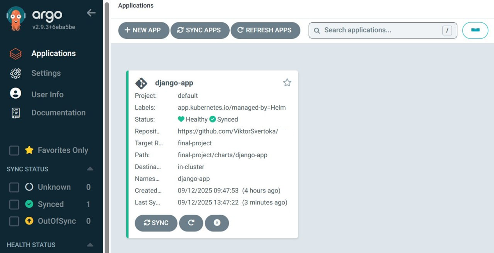

# DevOps CI/CD

# Terraform AWS Infrastructure — Lesson 5

## Опис проєкту

Цей проєкт демонструє створення інфраструктури AWS за допомогою Terraform із
застосуванням модульної архітектури. Він включає:

- Віддалене зберігання Terraform state в S3 із блокуванням через DynamoDB.
- Побудову мережевої інфраструктури VPC з публічними та приватними підмережами.
- Розгортання Elastic Container Registry (ECR) для зберігання Docker-образів.

---

## Структура проєкту

```
├── .gitignore
├── .prettierrc
├── README.md
├── assets/
│   ├── screen_01.png
│   ├── screen_02.png
│   ├── screen_03.png
│   ├── screen_04.png
│   ├── screen_05.png
│   ├── screen_06.png
│   └── screen_07.png
├── backend.tf               # Налаштування віддаленого бекенду (S3 + DynamoDB)
├── main.tf                  # Головний файл для підключення модулів
├── outputs.tf               # Загальні вихідні дані по інфраструктурі
├── modules/
│   ├── ecr/                 # Модуль для створення ECR репозиторію
│   │   ├── ecr.tf
│   │   ├── outputs.tf
│   │   └── variables.tf
│   ├── s3-backend/          # Модуль для створення S3 бакету і DynamoDB таблиці
│   │   ├── dynamodb.tf
│   │   ├── outputs.tf
│   │   ├── s3.tf
│   │   └── variables.tf
│   └── vpc/                 # Модуль для побудови мережевої інфраструктури (VPC)
│       ├── outputs.tf
│       ├── routes.tf
│       ├── variables.tf
│       └── vpc.tf
```

```bash
# Ініціалізація Terraform (завантаження провайдерів і модулів)
terraform init

# Перегляд планованих змін інфраструктури
terraform plan

# Застосування конфігурації
terraform apply

# Видалення інфраструктури
terraform destroy

```

## Налаштування віддаленого бекенду

Після початкового розгортання для активації віддаленого бекенду:

1. Розкоментуйте блок конфігурації бекенду в `backend.tf`.

2. Виконайте міграцію стану:

```bash
terraform init -migrate-state
```

## Опис модулів

### Модуль `s3-backend`

- **Призначення:** Централізоване зберігання Terraform state.

- **Ресурси:**

  - S3 бакет з увімкненим шифруванням, версіюванням та блокуванням публічного
    доступу.
  - DynamoDB таблиця для блокування стану.

- **Переваги:** Безпечне та надійне зберігання стейту з підтримкою блокування.

---

### Модуль `vpc`

- **Призначення:** Побудова мережевої інфраструктури AWS.

- **Ресурси:**

  - VPC з CIDR блоком `10.0.0.0/16`.
  - 3 публічні та 3 приватні підмережі.
  - Internet Gateway та NAT Gateway з Elastic IP.
  - Таблиці маршрутизації.

- **Переваги:** Ізоляція мережевого трафіку, масштабованість, безпечний
  інтернет-доступ.

---

### Модуль `ecr`

- **Призначення:** Репозиторій для зберігання Docker-образів.

- **Ресурси:**

  - ECR репозиторій з політиками життєвого циклу і автоматичним скануванням.

- **Переваги:** Безпечне керування образами, автоматична перевірка вразливостей.

---

## Важливі нотатки

### Безпека

- S3 бакет шифрується і блокує публічний доступ.
- DynamoDB блокує одночасні зміни стану.
- Приватні підмережі мають доступ до інтернету через NAT Gateway.
- ECR виконує автоматичне сканування образів на уразливості.

### Витрати

- NAT Gateway – основне джерело витрат (~$45/місяць за кожен).
- S3 і DynamoDB мають мінімальні витрати.
- Elastic IP безкоштовні при використанні.

### Відновлення після видалення

Якщо видалено інфраструктуру та state:

1. Закоментуйте конфігурацію бекенду в `backend.tf`.
2. Виконайте `terraform init`.
3. Застосуйте конфігурацію `terraform apply`.
4. Розкоментуйте бекенд та виконайте `terraform init -reconfigure`.

---

## Регіон розгортання

US East (N. Virginia) `us-east-1`.




